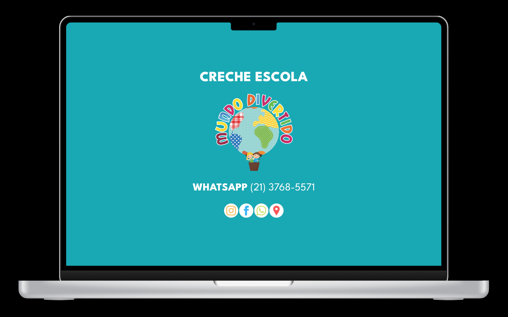
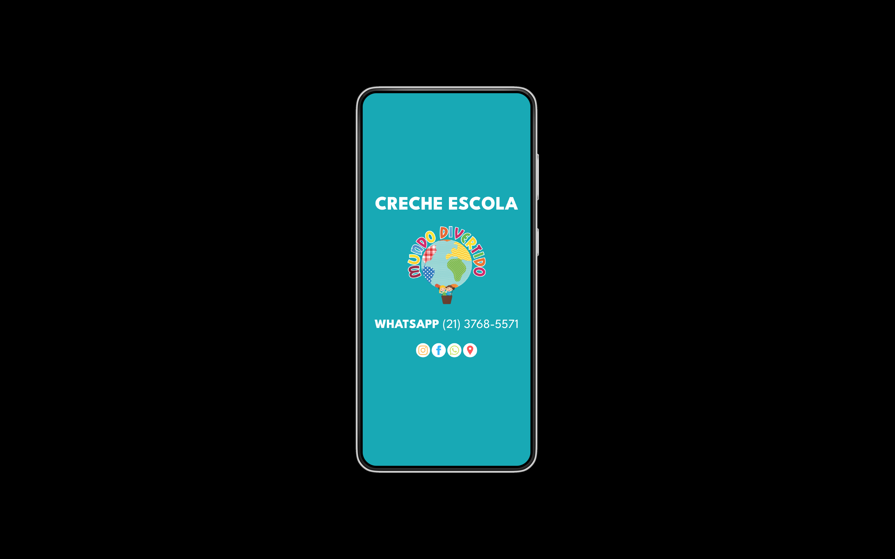

# Creche Escola Mundo Divertido

The Creche Escola Mundo Divertido is a local business that provides kindergarten services in Nova Iguaçu, Rio de Janeiro, Brazil.

This website does not track users, and does not use cookies, but it uses Google Fonts.

Icons where from iconmonstr. The website is hosted on GitHub Pages.

You can not use the name and logo. You can copy the code and use it for your own website without any guarantees.

## Preview

### Desktop

### Mobile

